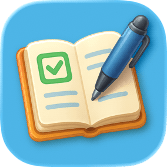
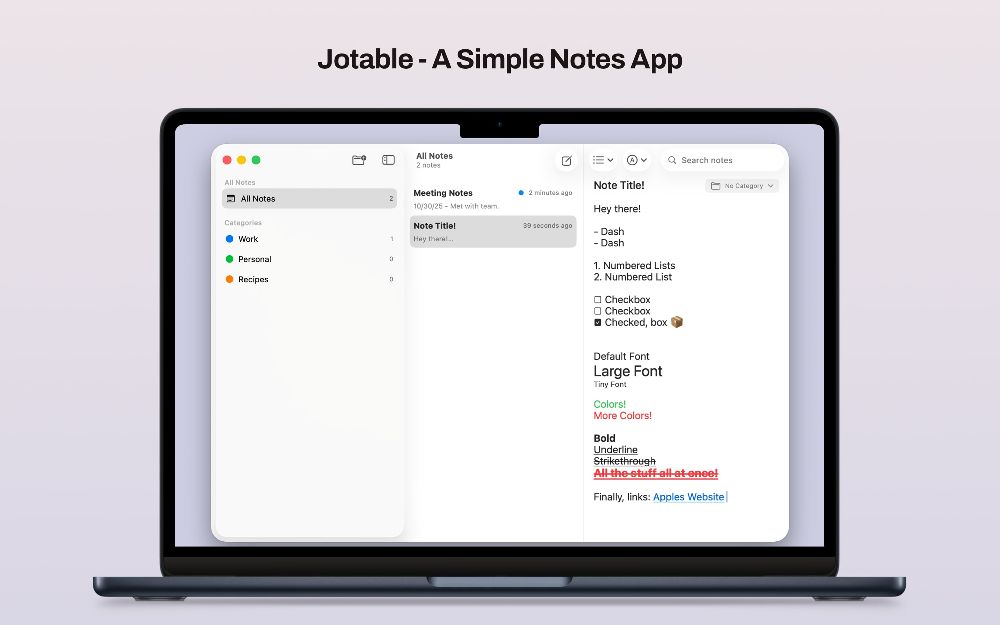
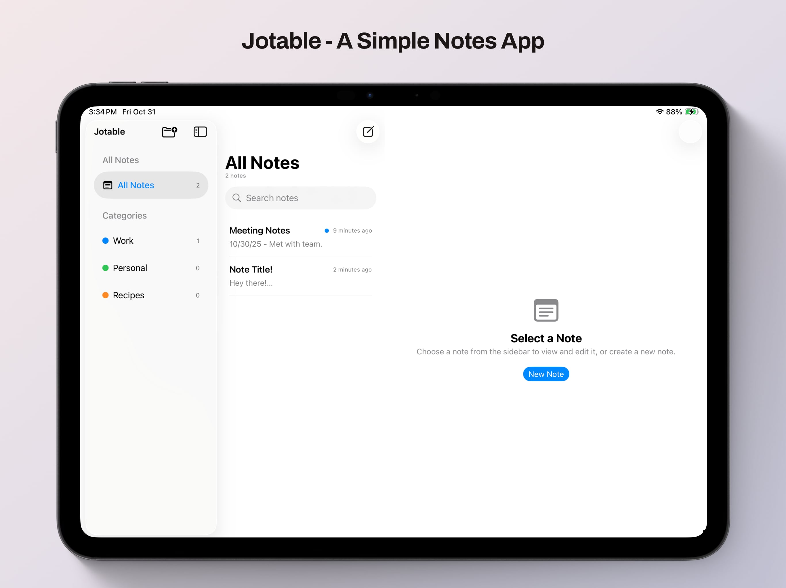
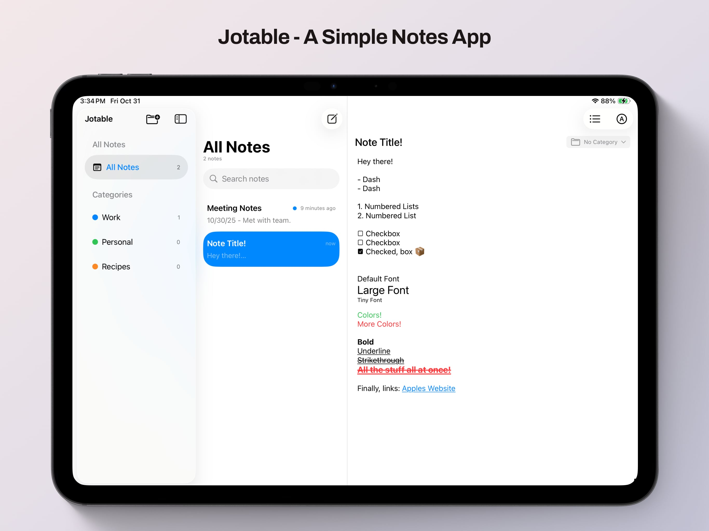
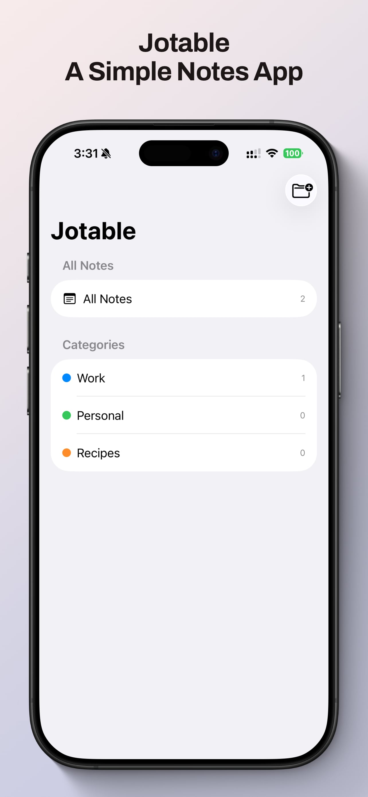
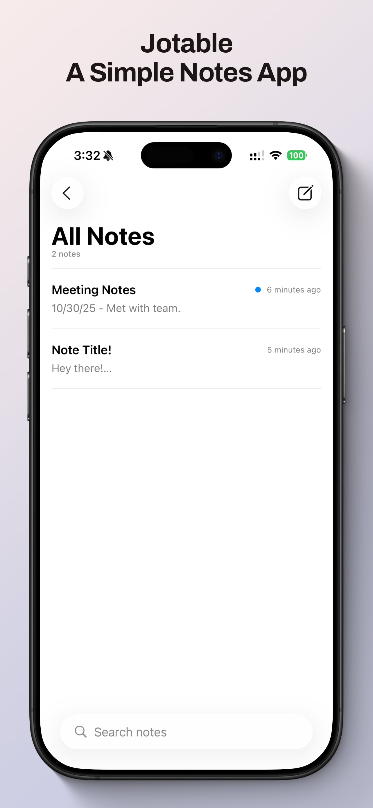
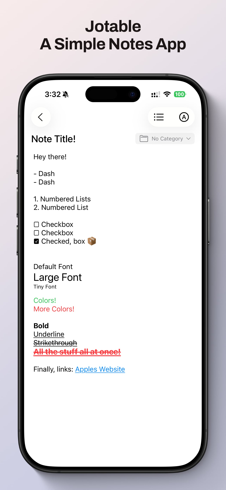

<picture>
  <source srcset="Documentation/icon-dark.png" media="(prefers-color-scheme: dark)">
  <source srcset="Documentation/icon-light.png" media="(prefers-color-scheme: light)">
  
</picture>
  

<h2>Jotable is a tiny, no-frills notes app designed for people who want speed, simplicity, and privacy. 
Create and organize your thoughts effortlessly — across iPhone, iPad, and Mac — with seamless iCloud sync.</h2>
  

    

    
    

    
    
    

## Features

🗂 Organize by Categories  
Keep your ideas tidy with easy-to-manage categories.

✏️ Smart Note Formatting  
Add automatic dashes, numbering, checkboxes, and links as you type — no extra steps required.

🎨 Customizable Text  
Adjust font size, color, bold, underline, and strikethrough to make your notes your own.

☁️ iCloud Sync  
Your notes stay up-to-date and available on all your Apple devices.

🧘‍♂️ Just Notes — Nothing Else  
No AI. No ads. No in-app purchases.  
Just a clean, focused space for your thoughts.

## 🖥️ Install & Minimum Requirements

- macOS 26.0 or later  
- Apple Silicon & Intel (Not tested on Intel)
- ~20 MB free disk space  

### ⚙️ Installation

<a href="https://apps.apple.com/us/app/jotable-simple-notes/id6754772226">App Store for macOS, iOS, and iPadOS</a>

## 📝 Changelog

### 1.2.0
- Added
 - Password Generator Tool. 
 - Last open note is now remembered, and re-open on app launch. 
 - Multi note delete.
 - Inserted images are now resizeable. 
 - Added context menu for main app icon on iOS & macOS to quickly make a new note. 
 - macOS: Keyboard shortcuts for Bolt, Italics. 

 - Fixed
  - Edge cases with text box insertion. 
  - Preview will more effectively show the first text, not just the first line. 
  - Authentication loop when jumping between private categories. 

### 1.1.1
- Bugfixes with the Paste as Plaintext feature. 
- Bugfixes with inserting Checkbox / Dash / Bullet / Numbers into lines with emojis & other characters. 
- Checkboxes on iOS now properly support Shake to Undo.

### 1.1.0
- Added private categories. (FaceID / TouchID required to unlock)
- Added clickable checkboxes. Click to toggle! 
- Added Insert Date & Insert Time tools.
- Added Insert Bullet tool. 
- Added Highlighter tool. 
- Added Italics Font. 
- Added pasteable images. 
- Added "paste plaintext" on Mac. (cmd+shift+v)
- Added Insert Checkbox / Dash / Bullet / Numbering on selected text.
- Added editable Links on iOS.
- Lots of bugfixes.

### 1.0.0
- Initial Release. 

## 📄 License

MIT — free for personal and commercial use. 

## Privacy
<a href="Documentation/PrivacyPolicy.html">Privacy Policy</a>

## Support 
<a href="Documentation/Support.html">Support</a>